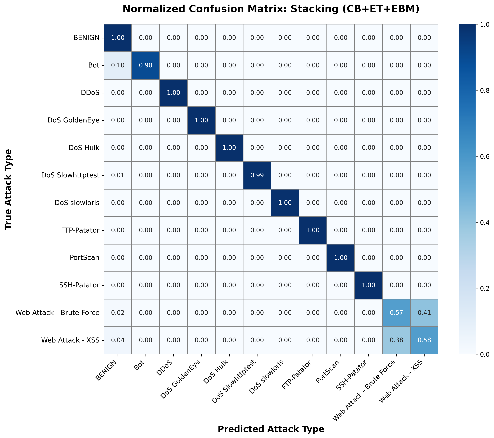
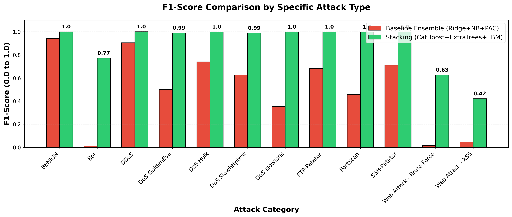
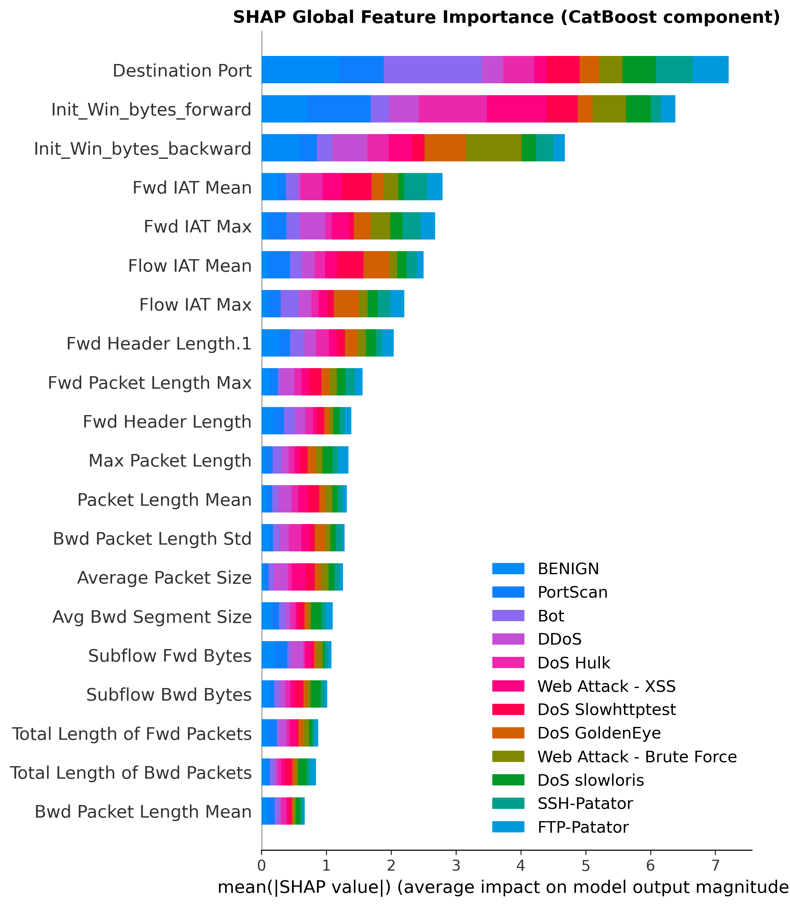
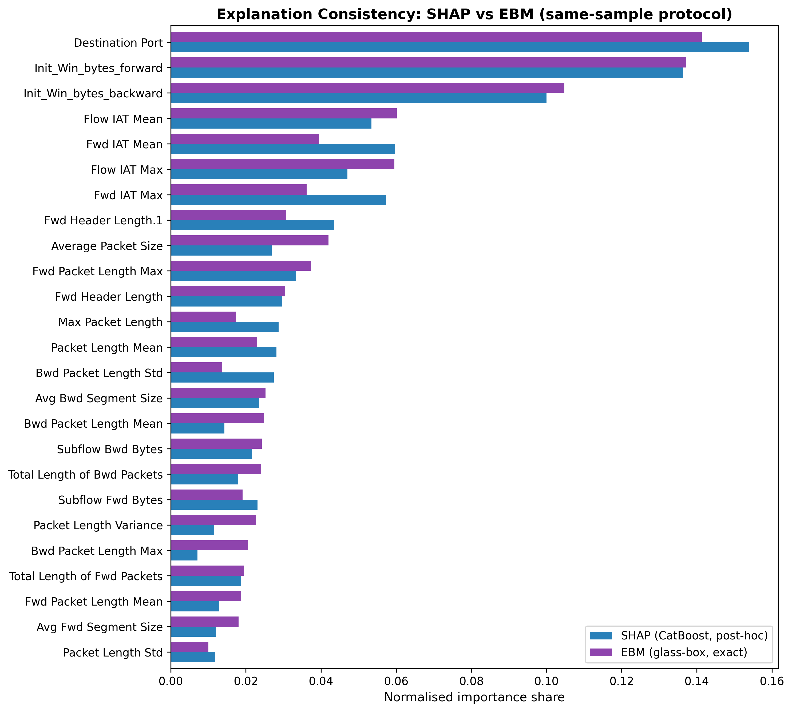

# GlassBox Stacked NIDS: Explainable AI for Network Intrusion Detection


A robust, enterprise-grade **Stacked-Ensemble Network Intrusion Detection System (NIDS)** that prioritizes **Explainable AI (XAI)**. This project bridges the gap between high-performance black-box models (like CatBoost and ExtraTrees) and interpretable glass-box models (Explainable Boosting Machines), proving that you don't have to sacrifice transparency for accuracy in threat detection.

This methodology was formally evaluated on the **CICIDS-2017** dataset and rigorously validated cross-dataset on **UNSW-NB15**.

---

## 🚀 Key Highlights & Architecture

The architecture utilizes a meta-learner stacking approach combined with per-class decision-threshold calibration and SMOTE/ADASYN for minority-class remediation (e.g., catching rare zero-day behaviors).

1. **High Detection Efficacy:** Achieves **99.84% F1-Score** on CICIDS-2017 and **82.10% F1-Score** on the highly complex UNSW-NB15 dataset.
2. **Rigorously Tested Explanation Trust:** The embedded glass-box member (EBM) gives an exact, no-extra-cost reference to check post-hoc **SHAP** explanations against, and the manuscript tests, rather than assumes, whether that check functions as a deployable trust signal. The honest result: it largely does not outperform the model's own confidence score, a finding reported in full rather than a "we ensured agreement" claim.
3. **Optimized Latency:** Balances inference speed (latency) with detection accuracy via Pareto frontier analysis, making it viable for real-time SOC environments.

---

## 📊 Performance & Outcomes

### Baseline vs. Calibrated Stacking Performance
| Dataset | Model | Accuracy | F1 (weighted) | MCC |
|---|---|---|---|---|
| **CICIDS-2017** | Baseline Ensemble | 0.8788 | 0.8899 | 0.6585 |
| **CICIDS-2017** | **Stacking + Thresholds** | **0.9984** | **0.9984** | **0.9953** |
| **UNSW-NB15** | Baseline Ensemble | 0.5479 | 0.6128 | 0.4828 |
| **UNSW-NB15** | **Stacking + Thresholds** | **0.8174** | **0.8210** | **0.7644** |

### Confusion Matrix (CICIDS-2017)
The system successfully isolates and classifies highly evasive attacks, minimizing false positives.


### Per-Class F1 Score Comparison
Demonstrating massive improvements in detecting rare, sophisticated attacks (like Web Attacks and Infiltration) through dynamic threshold calibration.


---

## 🧠 Explainable AI (XAI) & Model Transparency

In modern cybersecurity, black-box ML models are a liability. If a model blocks traffic, the Security Operations Center (SOC) needs to know exactly *why*. 

### Feature Importance & Agreement (SHAP vs EBM)
We extract Global Feature Importances using SHAP (for CatBoost/ExtraTrees) and compare them natively against the Glass-Box EBM.


### Evaluating Explanation Agreement
We measure statistical correlation (Spearman/Kendall) and Top-K overlap between SHAP and the exact EBM reference, then test directly whether that agreement functions as a usable trust signal for an operator. It largely does not: the manuscript reports this as a tested negative result, not an assumed guarantee.


---

## 📂 Repository Structure

```
glassbox-stacked-nids/
├── notebooks/
│   ├── NIDS_Upgraded_v4.ipynb          # CICIDS-2017 main pipeline
│   └── NIDS_UNSW_NB15_Native.ipynb     # UNSW-NB15 cross-dataset validation
├── data/                                # Dataset download instructions
├── figures/                             # Generated metric graphs and XAI charts
├── results/                             # Ablation / calibration / agreement tables (CSV)
└── manuscript/
    ├── manuscript.docx                  # Main manuscript (venue-neutral; retitled per current target journal)
    ├── title_page.docx                  # Title page with author/ORCID/abstract/keywords
    └── cover_letter.docx                # Cover letter (content is addressed to whichever journal is the current submission target)
```

## 🛠️ Setup & Execution

```bash
# Initialize virtual environment
python -m venv .venv && source .venv/bin/activate

# Install dependencies
pip install -r requirements.txt
```

Download the raw datasets per [`data/README.md`](data/README.md), then run the Jupyter notebooks in `notebooks/` from top to bottom. Each notebook automatically generates its own visualizations into `figures/` and tabular data into `results/`.

## 📜 License
MIT, see [LICENSE](LICENSE).
